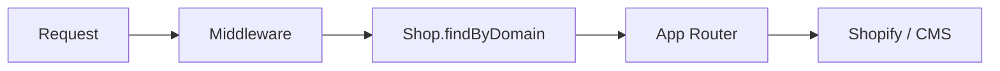

Nordcom Commerce is a single Next.js deployment that serves many tenants. Tenants are
resolved by hostname in middleware before any page renders. No per-tenant build, no
per-tenant deploy — one binary, many storefronts.

## Request flow

The middleware at `apps/storefront/src/proxy.ts` is the entry point for every request:

1. Paths starting with `/admin` dispatch to `admin()` in `src/middleware/admin.ts`;
   everything else goes to `storefront()`.
2. `storefront()` reads `req.headers.host`, normalizes it (strips ports, `.localhost`,
   Vercel preview suffixes), and calls `Shop.findByDomain(hostname)`, which resolves the
   tenant through the Convex `db/shops` query seam.
3. On a hit, the resolved domain is injected into the URL so the App Router serves the
   page from `src/app/[domain]/[locale]/…`.
4. On `NotFoundError`, the middleware rewrites to `SERVICE_DOMAIN/status/unknown-shop/`.
   Other commerce errors rewrite to `/status/unknown-error/`.
5. Locale is resolved after the shop — see [Locales](/concepts/locales/) for the
   full fallback chain.

<Callout type="info">
    The App Router never sees an un-tenanted request. Every route lives under
    `[domain]/[locale]/…` — there are no root-level routes that need to figure out which
    shop they are serving.
</Callout>

## Data layer

Data lives in a Convex deployment (`packages/convex` owns the schema and server
functions). App access goes through `@nordcom/commerce-db` — the only workspace that
talks to the Convex `db/*` functions; every other consumer imports the high-level service
classes (`ShopService`, `UserService`, `ReviewService`, `FeatureFlagService`) from there.

`@nordcom/commerce-db` is marked `server-only`. Importing it from a client component or
calling a service without `CONVEX_URL` in the environment will throw.

## Commerce layer

Shopify Storefront and Admin APIs sit behind `AbstractApi` in
`apps/storefront/src/utils/abstract-api.ts`. Build one via
`ShopifyApolloApiClient({ shop, locale })` — never call Apollo directly from a route.

The `@inContext(country, language)` directive is injected automatically by the Apollo
`DocumentTransform` from `@nordcom/commerce-shopify-graphql`. Source operations must not
pre-declare these arguments — the transform owns them.

## Content layer

Structured content (pages, articles, navigation, product/collection metadata overlays)
lives in Convex; `@nordcom/commerce-cms` defines the content shapes (field descriptors),
the editor the admin app mounts at `/cms`, and the storefront's block render layer. The
storefront reads content through the Convex `cms/read` functions. See
[CMS](/concepts/cms/) for the block model and block loader pattern.

## Error layer

A shared, code-tagged error hierarchy lives in `@nordcom/commerce-errors`. Every thrown
error in the platform is an instance of one of these classes — never `new Error(...)`.
Each class carries a stable `code`, an HTTP `statusCode`, and a help URL. See
[Errors](/concepts/errors/) for the full class inventory and how to add new errors.

## Cache layer

Tag-based cache invalidation is handled by the `@tagtree` package family. Tag schemas are
declared as typed TypeScript objects; builders and invalidators are derived from them.
Every entity loader in the storefront tags its cached payload; Shopify webhooks and CMS
`afterChange` hooks call `revalidateTag` to flush exactly the affected entries. See
[Caching](/concepts/caching/) for the tag schema and namespace details.

<ContinueExploring items={[
    {
        eyebrow: 'Concepts · next up',
        title: 'Multi-tenancy',
        description: 'Resolution chain, the tenant-context contract, and cache isolation.',
        href: '/concepts/multi-tenancy/',
        tab: 'docs',
    },
    {
        eyebrow: 'Concepts',
        title: 'Caching',
        description: 'TagTree namespaces, invalidation flow, and per-route cache lifetimes.',
        href: '/concepts/caching/',
        tab: 'docs',
    },
    {
        eyebrow: 'Concepts',
        title: 'CMS',
        description: 'Descriptor-defined blocks, block loaders, and the multi-tenant content layer.',
        href: '/concepts/cms/',
        tab: 'docs',
    },
    {
        eyebrow: 'Concepts',
        title: 'Errors',
        description: 'The error hierarchy, HTTP status mapping, and the stable help-URL pattern.',
        href: '/concepts/errors/',
        tab: 'docs',
    },
]} />
